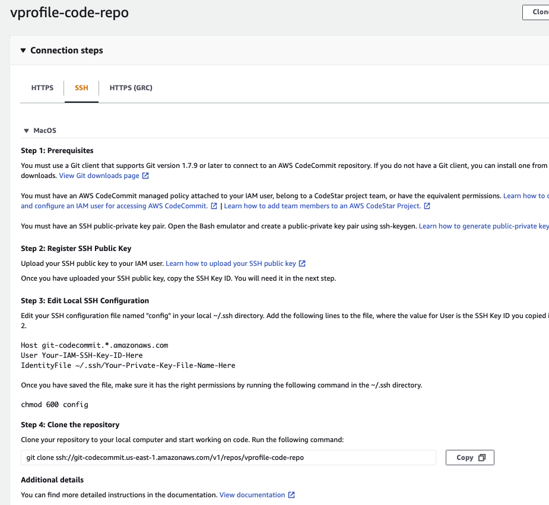
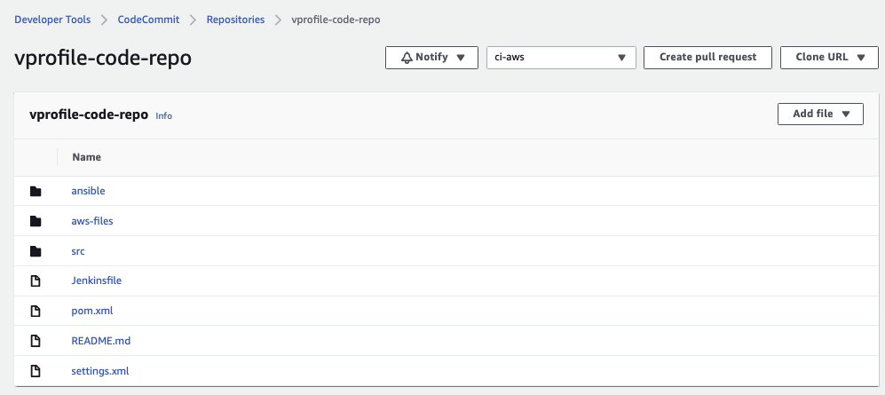
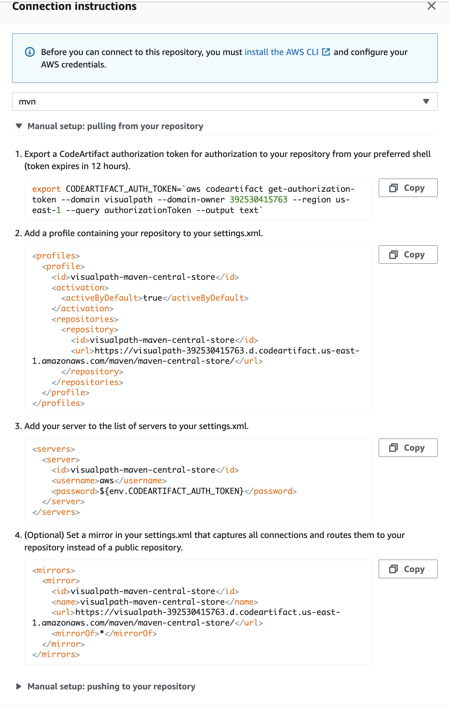
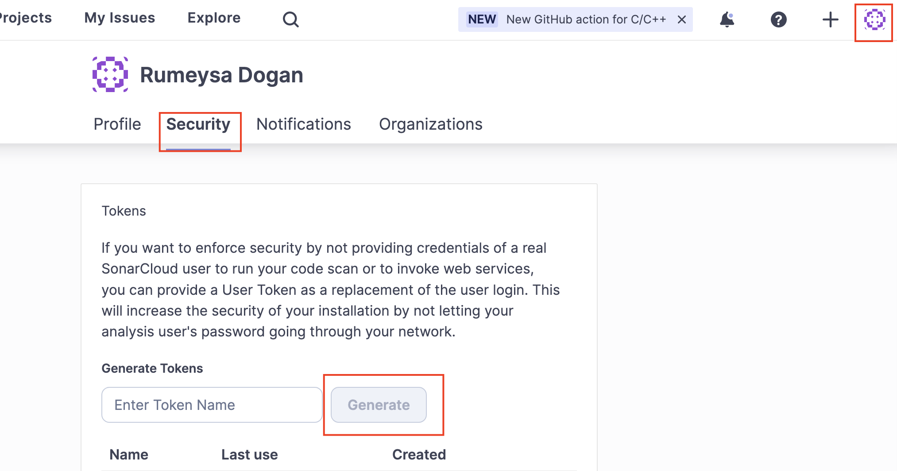
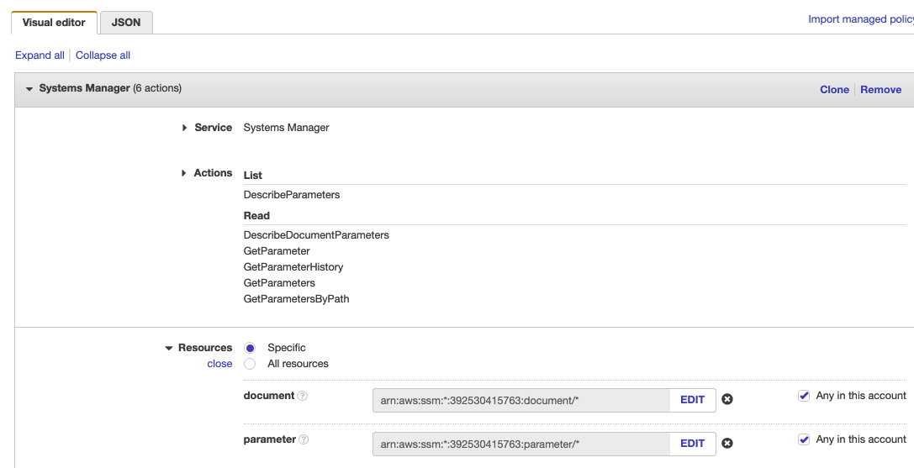
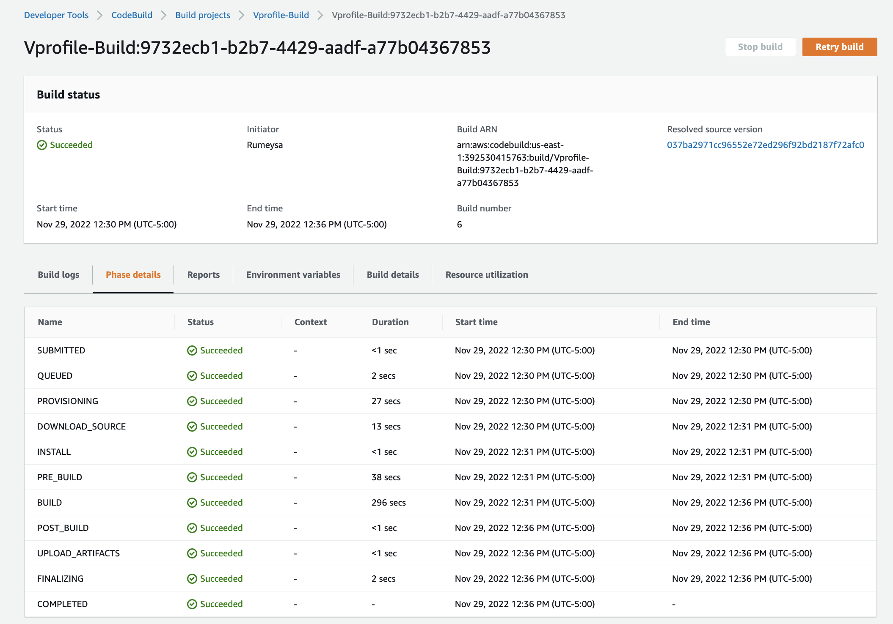
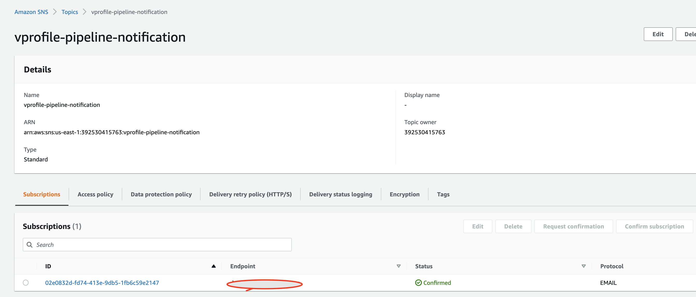
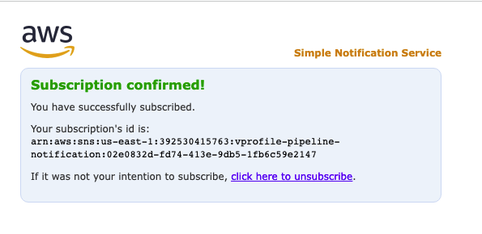

# Continuous Integration on AWS Cloud
### Pre-Requisites:

* AWS Account
* Sonar Cloud Account
* AWS CLI, Git installed on Local


### Step-1: Setup AWS CodeCommit 

From AWS Console, pick the `us-east-1` region and go to the `CodeCommit` service. Create repository.
```sh
Name: vprofile-code-repo
```

Next, we will create an IAM user with `CodeCommit` access from the IAM console. We will create a policy for `CodeCommit` and allow full access only for `vprofile-code-repo`.

```sh
Name: vprofile-code-admin-repo-full access
```


To connect our repo, we will follow the steps in CodeCommit.



First, Create the local SSH key and add the public key to the IAM role Security credentials.


We will also update the configuration under `.ssh/config` and add our Host information. And change permissions with `chmod 600 config`
```sh
Host git-codecommit.us-east-1.amazonaws.com
    User <SSH_Key_ID_from IAM_user>
    IdentityFile ~/.ssh/vpro-codecommit_rsa
```

We can test our ssh connection to CodeCommit.
```sh
ssh git-codecommit.us-east-1.amazonaws.com
```


Next we clone the repository to a location that we want in our local. I will use the Github repository for `vprofile-project` in my local, and turn this repository to CodeCommit repository. When I am in Github repo directory, I will run below commands.
[Project code](https://github.com/rumeysakdogan/vprofileproject-all.git)

```sh
git checkout master
git branch -a | grep -v HEAD | cur -d'/' -f3 | grep -v master > /tmp/branches
for i in `cat  /tmp/branches`; do git checkout $i; done
git fetch --tags
git remote rm origin
git remote add origin ssh://git-codecommit.us-east-1.amazonaws.com/v1/repos/vprofile-code-repo
cat .git/config
git push origin --all
git push --tags
```
- Our repo is ready on CodeCommit with all branches.



### Step-2: Setup AWS CodeArtifact

- We will create CodeArtifact repository for Maven.
```sh
Name: vprofile-maven-repo
Public upstraem Repo: maven-central-store
This AWS account
Domain name: visualpath
```
- Again we will follow connection instructions given in CodeArtifact for  `maven-central-repo`.



- We will need to create an IAM user for CodeArtifact and configure aws cli with its credentials. We will give Programmatic access to this user to be able to use aws cli and download credentials file.
```sh
aws configure # provide iam user credentials
```


Then we run command get token as in the instructions.
```sh
export CODEARTIFACT_AUTH_TOKEN=`aws codeartifact get-authorization-token --domain visualpath --domain-owner 392530415763 --region us-east-1 --query authorizationToken --output text`
```

Update pom.xml and setting.xml file with correct urls as suggested in instruction and push these files to codeCommit.
```sh
git add .
git commit -m "message"
git push origin ci-aws
```
### Step-3: Setup SonarCloud 

We need to have an account, from account avatar -> `My Account` -> `Security`. Generate token name as `vprofile-sonartoken`. Note the token.



Next we create a project, `+` -> `Analyze Project` -> `create project manually`. Below details will be used in our Build.
```sh
Organization: rumeysa-devops-projects
Project key: vprofile-repo-rd
Public
```

Our Sonar Cloud is ready!


### Step-4: Store Sonar variables in System Manager Parameter Store 

We will create paramters for below variables.
```sh
CODEARTIFACT_TOKEN	 SecureString	
HOST      https://sonarcloud.io
ORGANIZATION           rumeysa-devops-projects
PROJECT                vprofile-repo-rd
SONARTOKEN             SecureString
```

### Step-5: AWS CodeBuild for SonarQube Code Analysis

From AWS Console, go to `CodeBuild` -> `Create Build Project`. This step is similar to Jenkins Job.
```sh
ProjectName: Vprofile-Build
Source: CodeCommit
Branch: ci-aws
Environment: Ubuntu
runtime: standard:5.0
New service role
Insert build commands from foler aws-files/sonar_buildspec.yml
Logs-> GroupName: vprofile-buildlogs
StreamName: sonarbuildjob
```

We need to update sonar_buildspec.yml file paramter store sections with the exact names we have given in SSM Parameter store.

We need to add a policy to the service role created for this Build project. Find name of role from Environment, go to IAM add policy as below:



It is time to Build our project.



We can check from SonarCloud too.


I can add Quality Gate to this Build Project, we can create a Qulaity gate from SonarCloud and add to our project.

### Step-6: AWS CodeBuild for Build Artifact

From AWS Console, go to `CodeBuild` -> `Create Build Project`. This step is similar to Jenkins Job.
```sh
ProjectName: Vprofile-Build-Artifact
Source: CodeCommit
Branch: ci-aws
Environment: Ubuntu
runtime: standard:5.0
Use existing role from previous build
Insert build commands from foler aws-files/build_buildspec.yml
Logs-> GroupName: vprofile-buildlogs
StreamName: artifactbuildjob
```

Its time to build project.


### Step-7: AWS CodePipeline and Notification with SNS

First we will create an SNS topic from SNS service and subscribe to topic with email.



We need confirm our subscription from our email.



Next we create an S3 bucket to store our deploy artifacts.


Lets create our CodePipeline.
```sh
Name: vprofile-CI-Pipeline
SourceProvider: Codecommit
branch: ci-aws
Change detection options: CloudWatch events
Build Provider: CodeBuild
ProjectName: vprofile-Build-Aetifact
BuildType: single build
Deploy provider: Amazon S3
Bucket name: vprofile98-build-artifact
object name: pipeline-artifact
```

We will add Test and Deploy stages to our pipeline.

Last step before running our pipeline is we need to setup Notifications, go to Settings in `CodePipeline` -> `Notifications`. 

Time to run our CodePipeline.


### Step-8: Validate CodePipeline

We can make some changes in README file of source code, onc we push the changes CloudWatch will detect the changes and Notification event will trigger Pipeline.
